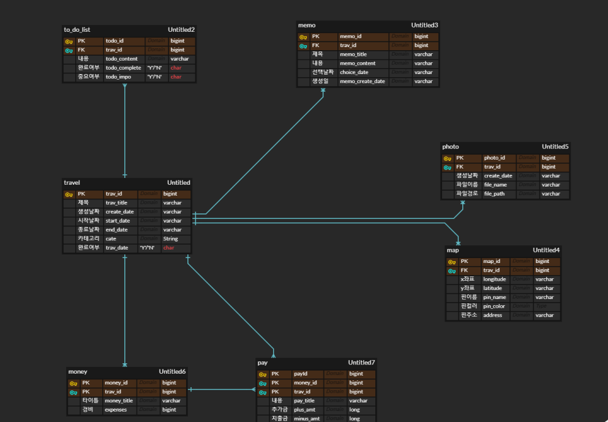
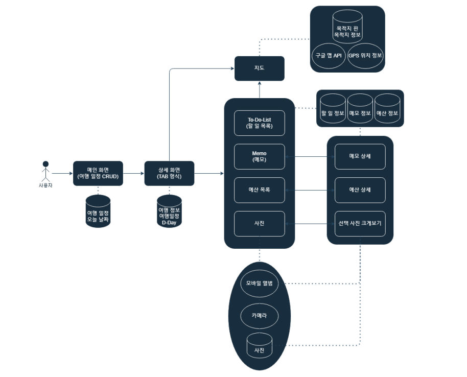

# QR Event Check Manager

# 프로젝트
> 개발기간 : 2024.10.02 ~ 2024.10.19

# 개발인원
> 5인

# 담당역할
> 팀장 
팀 기초 개발환경 세팅 및 배포 
ERD 기초설계 
React Web 연동 Back-End 구축  
React Front-End 참석자 관리 및 각종 검색기능 제작 

# Skills
>
 
 

 
 

# ERD & USE-CASE

ERD

USE-CASE

시연 영상

<video src="inTravelVideo.mp4">

# 주요기능
> 여행 정보 생성 
> 여행 D-Day 기능 
> 할 일(To Do List) 추가, 수정, 삭제, 중요체크, 완료체크 
> 메모 작성 가능 
> 예산 관리 
> 사진 촬영 후 앨범 기능 
> 지도 핀 마커 활용 기능 